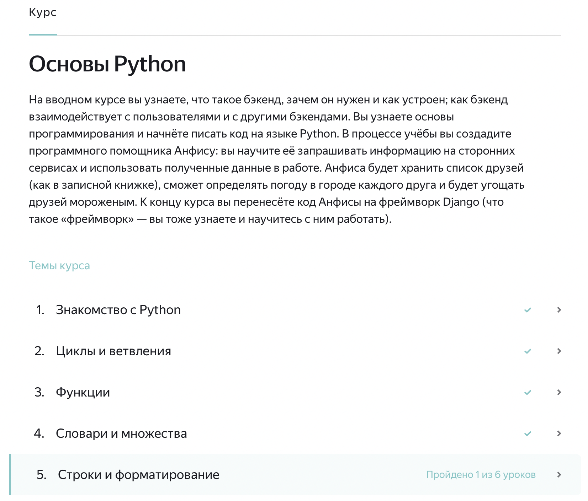

# Куда без Яндекса?..

Для наиболее простого старта в обучении рекомендую зарегистрироваться на Яндекс практикуме и пройти бесплатный 30ти часовой обучающий курс "Основы Python". 

Настоятельно советую пройти хотя бы 5 тем курса: 

### Ссылка на курс: ["Основы Python"](https://practicum.yandex.ru/profile/backend-developer/ "Яндекс.Практикум")
